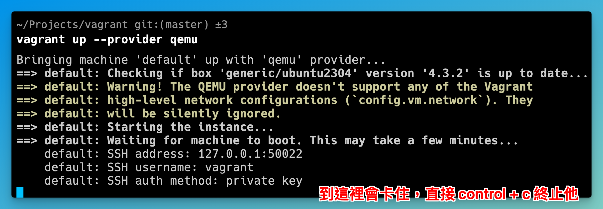
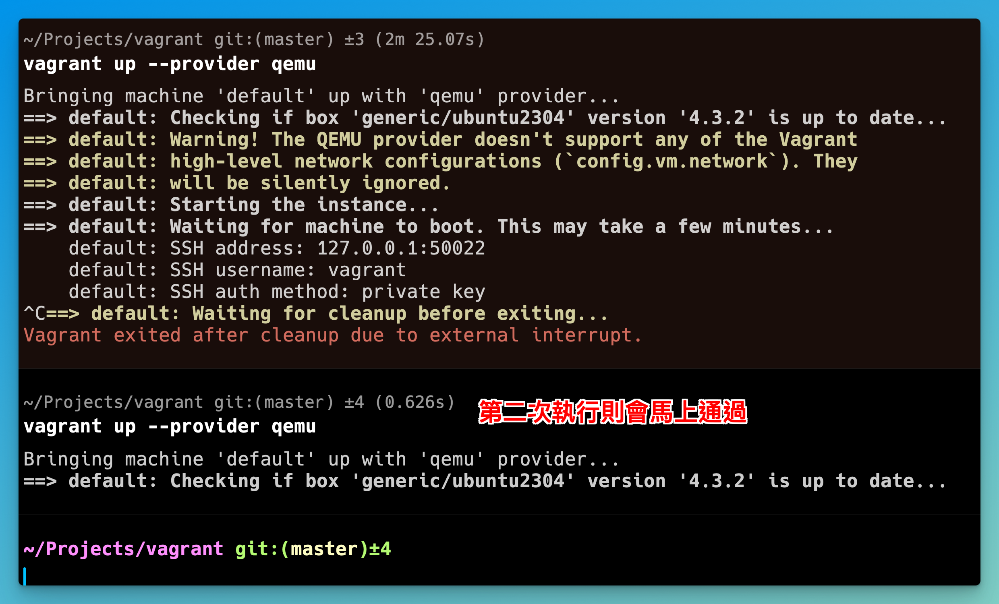
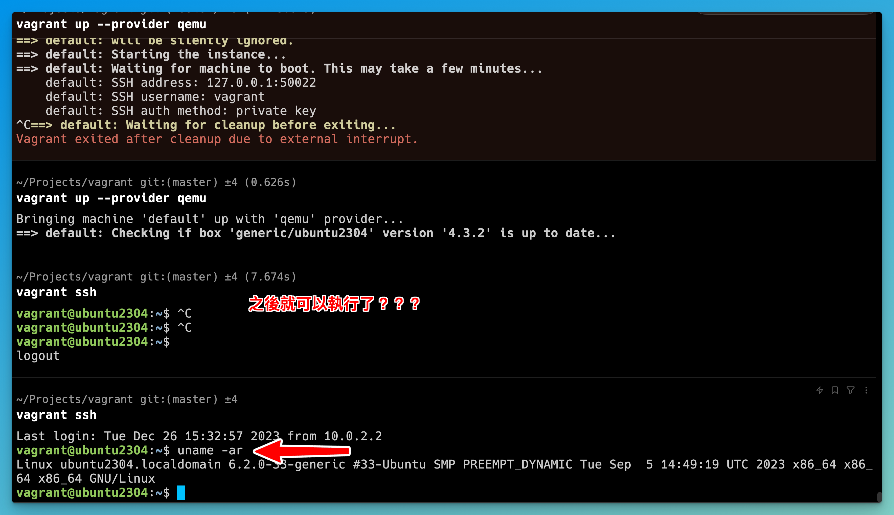

# MAC ARM64 VAGRANT (Apple Silicon like: M1, M2, etc...)

> Vagrant knows about the following providers: docker, hyperv, virtualbox, qemu, vmware_desktop, vmware_fusion

## INSTALL QEMU

```
brew install qemu
```

## INSTALL VAGRANT DRIVER

```
vagrant plugin install vagrant-qemu
```

## RUN VAGRANT WITH QEMU

```
vagrant up --provider qemu
```

## VAGRANT CONNECT
```
vagrant ssh
```

VAGRANT DRIVER WITH MAC SHOULD SET **QEMU_DIR** = `/opt/homebrew/share/qemu`

QEMU_DIR 需確定路徑是否正確， homebrew 有改位置，需確定對不對


## 成功截圖.. 也不知道為啥成功＝＝




## INSTALL VMWARE FUSION PLAYER (未成功)

```
vagrant up --provider vmware_fusion
```
[ref](https://sloopstash.com/blog/how-to-build-vm-on-apple-m1-m2-chip-mac-with-vmware-fusion-and-vagrant.html)
[vagrant-utils](https://developer.hashicorp.com/vagrant/install/vmware)
